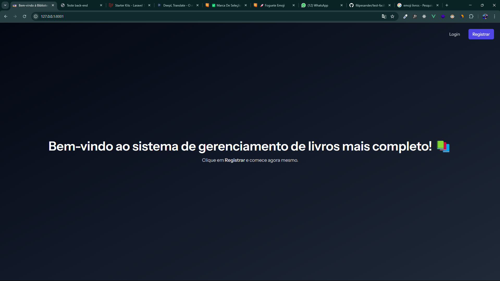

---


# Sistema de Biblioteca - Facilita 📚

Este projeto é uma aplicação web para gerencia livros, usuários, emprestimos de livros de uma biblioteca. Ele permite que o usuário visualize os livros, adicione emprestimos de livros, veja qual o status do livro que foi emprestado, entre outros. Sistema foi desenvolvido em Laravel 12, usando o Start Kit com Vue e Inertia e utilizando boas práticas de programação como **SOLID**, **Clean Code** **DDD** e  **KISS**.


---

## 🛠️ Tecnologias Utilizadas

- **PHP**: Linguagem principal do projeto.
- **MySQL**: Banco de dados relacional para armazenar informações.
- **Inertia 2**: Integração do front e back.
- **Vue 3**: Biblioteca para criar o frontend da aplicação.
- **TailwindCSS**: Framework CSS para estilização.

---

## 🚀 Funcionalidades

### 1. **Login e Cadastro**
- Todo o fluxo de login e cadastro de conta pelo Start Kit.

### 2. **CRUD de Livros + Filtros**
- Todo o crud mais filtros de livro, autor e status.

### 2. **CRUD de Usuários da Bibliote + Filtro**
- Todo o crud mais filtros de nome.

### 4. **Cria um emprestimo de Livros**
- Cria um emprestimo de livro de acordo com o livro e usuário existente da biblioteca.

### 5. **Altera um status de um emprestimo Emprestado/Devolvido**
- Altera o status de emprestimo do livro

### 6. **Alternar Tema**
- Adiciona suporte para alternar entre temas claro e escuro.

---

## 🔧 Pré-requisitos

1. **PHP 8.3+**
1. **Node 20+**
2. **Composer** instalado globalmente.
3. **MySQL** ou outro banco de dados compatível.
4. Um servidor web local, como Apache ou Nginx.
---

## 🛡️ Boas Práticas Utilizadas
- **SOLID**: Estrutura modular e escalável.
- **Clean Code** : Código limpo e legível, com documentação em métodos e classes.
- **DRY e KISS**: Código reutilizável e simples.

---

## 🛠️ Configuração e Execução

### 1. **Clona o projeto**
````
git clone git@github.com:filipesander/test-facilita.git
````

### 2. **Instale as dependências**

````
composer install
````
````
npm install
````

### 3. **Configure o .env do projeto**

````
cp .env.example .env
````

### 4. **Rode as migrations**
Depois de configurado as credenciais do banco rode as migrations:    

````
php artisan migrate
````

### 5. **Rode as seeders**
Depois de roda as migrations, execute as seeders para popular o banco:    

````
php artisan db:seed --class=GenreSeeder
````

& depois: 

````
php artisan db:seed 
````

### 6. **Suba os ambientes**
Por último   

````
npm run build && npm run dev
````
Em outro terminal no mesmo projeto

````
php artisan serve
````

### Abra o navegador e acesse: http://localhost:8000.


## ✅ Tela Inicial Esperada



### ✍️ Autor <br>
#### Desenvolvido por: **Filipe Sander Delmiro Oliveira.** <br>
#### Email: desenvolvedorfilipe@gmail.com
#### Linkedin: https://www.linkedin.com/in/filipe-sander-developer/ 
